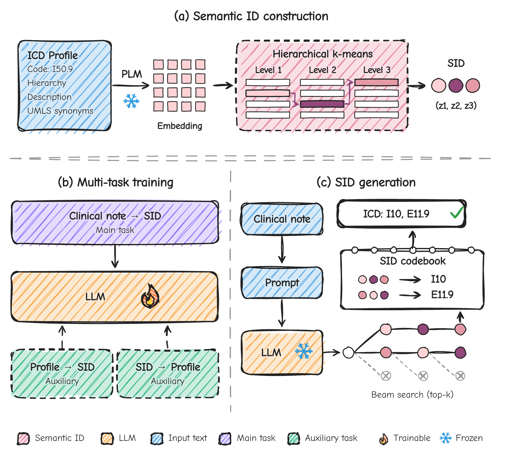

<div align="center">

# Beyond ICD Codes: Semantic IDs for Generative Medical Coding

[](#installation)
[](LICENSE)



</div>

SemICD treats ICD coding as generation. Each code becomes a hierarchical **Semantic ID (SID)**, and an LLM learns to write SIDs for a clinical note.

- **Semantic IDs.** Code profiles are embedded and clustered with hierarchical k-means, so similar codes share SID prefixes.
- **Bidirectional supervision.** Profile→SID and SID→profile tasks are trained alongside note→SID.
- **Constrained decoding.** Prefix-constrained beam search only produces valid SIDs, which are decoded to exact ICD sets.

## Installation

```bash
cd SemICD
python3.12 -m venv .venv && source .venv/bin/activate
pip install -e '.[train]'
```

Training needs Linux and an NVIDIA GPU with bfloat16 support. See the [Unsloth guide](https://unsloth.ai/docs/get-started/install) for a matching PyTorch build.

<details>
<summary>Quick check on synthetic data</summary>

This runs training and evaluation on invented data with a tiny model. No MIMIC or UMLS is needed.

```bash
bash examples/synthetic/run.sh artifacts/synthetic-check
```

It checks the plumbing only; its metrics say nothing about coding quality. Tested package versions are in `examples/synthetic/constraints.txt`.

</details>

## Data

MIMIC and UMLS must be obtained under their own access agreements.

| | MIMIC-IV (ICD-10-CM) | MIMIC-III (ICD-9 Full) |
| --- | --- | --- |
| Labels | Diagnoses | Diagnoses and procedures |
| Notes and splits | [Edin et al.](https://github.com/JoakimEdin/medical-coding-reproducibility) MIMIC-IV v2.2 | Edin et al. MIMIC-III v1.4 |
| Code hierarchy | CDC/NCHS FY2020 files (FY2015 optional) | Local catalog and path exports |
| Synonyms | Your licensed UMLS `MRCONSO.RRF` | Local UMLS term export |

> [!IMPORTANT]
> Keep every label. For MIMIC-IV, set `MIN_TARGET_COUNT = 1` in Edin et al.'s [`prepare_mimiciv.py`](https://github.com/JoakimEdin/medical-coding-reproducibility/blob/main/prepare_data/prepare_mimiciv.py).

## Running the pipeline

### Steps 1–2: prepare the dataset and code profiles

**MIMIC-IV (ICD-10-CM)**

```bash
OUT=artifacts/mimiciv
semicd prepare-dataset --upstream-file /path/to/mimiciv_icd10.feather \
  --splits-file /path/to/mimiciv_icd10_split.feather --output-dir $OUT/data
semicd prepare-ontology --codes-file $OUT/data/train_codes.json \
  --primary-dir /path/to/FY2020 --supplement-dir /path/to/FY2015 --output-dir $OUT/ontology
semicd prepare-umls --codes-file $OUT/data/train_codes.json \
  --umls-file /path/to/MRCONSO.RRF --release 2024AA --output-dir $OUT/umls
semicd prepare-profiles --codes-file $OUT/data/train_codes.json \
  --ontology-file $OUT/ontology/ontology.jsonl \
  --umls-terms-file $OUT/umls/umls_terms.json --output-dir $OUT/profiles
```

**MIMIC-III (ICD-9 Full)**

```bash
OUT=artifacts/mimiciii
semicd prepare-dataset --upstream-file /path/to/mimiciii_full.feather \
  --splits-file /path/to/mimiciii_full_splits.feather --output-dir $OUT/data
semicd prepare-icd9-inputs --codes-file $OUT/data/train_codes.json \
  --catalog-file /path/to/structured_profiles.csv --paths-file /path/to/official_paths.csv \
  --umls-terms-file /path/to/icd_synonyms.json --source-contract /path/to/source_contract.json \
  --output-dir $OUT/inputs
semicd prepare-profiles --codes-file $OUT/data/train_codes.json \
  --ontology-file $OUT/inputs/ontology.jsonl \
  --umls-terms-file $OUT/inputs/umls_terms.json --output-dir $OUT/profiles
```

`prepare-dataset` detects the dataset and checks its statistics against the paper. If they do not match, it stops and writes the counts to `$OUT/data/manifest.json`.

### Steps 3–6: build the codebook, train and evaluate

The same commands work for both datasets.

```bash
# 3. SID codebook (HKM, K=128, L=3, Qwen3-Embedding-4B)
semicd build-codebook --profiles-file $OUT/profiles/profiles.jsonl --output-dir $OUT/codebook
# 4. Training tasks: note→SID, profile→SID, SID→profile
semicd prepare-training --train-file $OUT/data/train.jsonl \
  --profiles-file $OUT/profiles/profiles.jsonl --sid-bundle $OUT/codebook --output-dir $OUT/tasks
# 5. Train; the best validation checkpoint is kept
semicd train --model-name-or-path Qwen/Qwen3-0.6B --train-file $OUT/tasks/train.jsonl \
  --validation-file $OUT/data/validation.jsonl --output-dir $OUT/run
# 6. Evaluate on the test split
semicd evaluate --checkpoint $OUT/run --eval-file $OUT/data/test.jsonl --output-dir $OUT/test
```

Metrics are written to `$OUT/test/metrics.json`. Use `Qwen/Qwen3-4B` for the larger backbone.

<details>
<summary>Baselines and ablations</summary>

Build a different codebook in step 3, then rerun steps 4–6 with it:

```bash
# Random SID: same SIDs, randomly reassigned to codes
semicd build-codebook --representation random --source-bundle $OUT/codebook --output-dir $OUT/random
# Atomic ID: one token per code
semicd build-codebook --representation atomic --codes-file $OUT/data/train_codes.json --output-dir $OUT/atomic
# RK-Means or RQ-VAE quantizer (reuses the step 3 embeddings)
semicd build-codebook --method rkmeans --profiles-file $OUT/profiles/profiles.jsonl \
  --embedding-dir $OUT/codebook-embeddings --output-dir $OUT/rkmeans
```

**Raw ICD** generates code strings directly and skips steps 2 and 4:

```bash
semicd build-codebook --representation raw --codes-file $OUT/data/train_codes.json --output-dir $OUT/raw
semicd train --model-name-or-path Qwen/Qwen3-0.6B --train-file $OUT/data/train.jsonl \
  --validation-file $OUT/data/validation.jsonl --sid-bundle $OUT/raw --output-dir $OUT/raw-run
```

For ICD-9 Full, add `--max-new-tokens 512` or more to the Raw training command, since its answers are long.

</details>

<details>
<summary>Input details</summary>

**Codes.** Codes are uppercase, with no decimal point and leading zeros kept. ICD-9 Full prefixes each code with its type, so diagnosis `003.1` becomes `DIAG:0031` and procedure `00.31` becomes `PROC:0031`.

**Notes table.** It needs `_id`, `subject_id` and `text`, plus `icd10_diag` (MIMIC-IV) or `icd9_diag` and `icd9_proc` (MIMIC-III). The split table needs `_id` and `split` (`train`, `val` or `test`).

**ICD-10-CM sources.** File names and download links are in [`configs/sources/icd10cm.json`](configs/sources/icd10cm.json). FY2015 is only used for codes missing from FY2020.

**ICD-9 Full exports.** The catalog CSV needs `code_norm`, `official_code`, `code_kind` (`diagnosis` or `procedure`), `chapter_text`, `block_text`, `category_text` and `description`. The path CSV needs `code_norm`, `chapter_id`, `block_id`, `category_id` and `leaf_id`. `code_norm` uses typed codes; `official_code` and `leaf_id` use dotted codes. The UMLS JSON maps dotted codes to lists of raw terms. The source contract can record `ontology_edition` and `umls_release`; `{}` is allowed.

**Outputs.** Each step writes a `manifest.json` with sources and coverage, and an `issues.json` for codes it could not process. UMLS terms stay on your machine and are not redistributed.

</details>

## Code layout

| Folder | Steps |
| --- | --- |
| `src/semicd/data/` | 1–2: dataset and code profiles |
| `src/semicd/codebook/` | 3: embeddings, HKM / RK-Means / RQ-VAE, SID bundle |
| `src/semicd/training/` | 4–6: tasks, fine-tuning, constrained decoding, evaluation |

## Acknowledgements

Data preparation follows [Edin et al.](https://github.com/JoakimEdin/medical-coding-reproducibility). The RQ-VAE model is adapted from [LC-Rec](https://github.com/RUCAIBox/LC-Rec), and training uses [Unsloth](https://github.com/unslothai/unsloth). MIMIC, UMLS and pretrained models remain subject to their own licenses; the code is [MIT-licensed](LICENSE).
